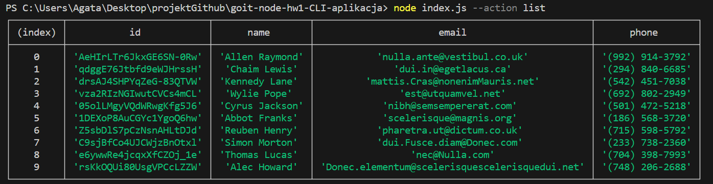
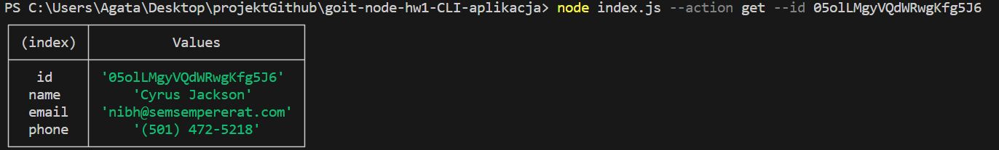
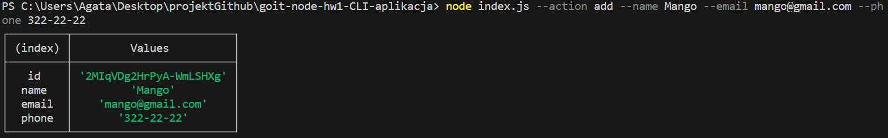
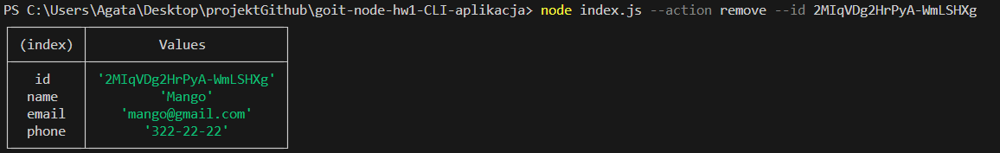

# CLI contacts app

## Actions results:

### list

### get

### add

### remove

### list

1. To display a list of all contacts, use the command:

2. node index.js --action list
   

### get

1. To fetch detailed information about a contact, use the command:

2. node index.js --action get --id "..."
   

### add

1. To add a contact, use the command:

2. node index.js --action add --name "..." --email "..." --phone "..."
   

### remove

1. To remove a contact, use the command:

2. node index.js --action remove --id "..."
   
